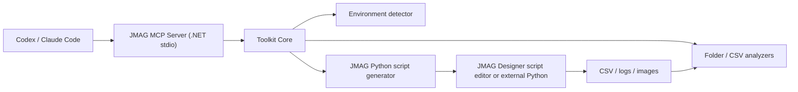

# Architecture

The MCP server does not embed JMAG binaries or require JMAG libraries at compile time. It generates and organizes scripts that call JMAG's own scripting APIs on the licensed machine.

This keeps the repo portable and avoids redistributing proprietary software.
